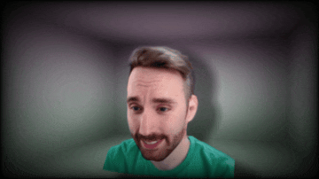

# Maxine Telepresence

## Overview

Maxine Telepresence contains reference applications and libraries to create immersive telepresence experiences. The applications can join multiple remote participants into an immersive video conference, using standard web cameras and microphones as input.

Each video feed is processed through a pipeline that includes head-tracking, background segmentation, and 2D-to-3D conversion to create a 3D representation of that participant, which can be rendered to a standard display or a 3D display. The images below show an example input image and the corresponding output rendered from a novel viewpoint.

<table>
  <tr>
    <td></td>
    <td></td>
  </tr>
  <tr>
    <td align="center">Input video frame</td>
    <td align="center">Rendered from novel viewpoints</td>
  </tr>
</table>

The video processing pipeline from capture to render is shown below. These steps can be executed on the sender side of a connection (before transmission over the network), on the receiver side, or can even be split between sender and receiver. The reference applications demonstrate some of the experiences that are possible with these features.

There are several reference applications for different types of experiences. See [Applications](src/Applications/Applications.md) for more details:

- [Applications > LocalVideoConferencing](src/Applications/Applications.md#localvideoconferencingapplication-apps_local): 1:1 immersive telepresence experience with networking
- [Applications > Playback](src/Applications/Applications.md#playbackapplication-apps_playback):            Simulation of 1:1 immersive telepresence experience with local processing
- [Applications > MagicMirrorLocal](src/Applications/Applications.md#magicmirrorlocalapplication-apps_mirror):      Single user 3D real time experience -- see a 3D version of yourself

The applications all share a common design for user interaction and configuration. See [Applications > Common](src/Applications/Applications.md#common-apps_common) for more details.

The diagram below shows the system architecture for the [LocalVideoConferencing](src/Applications/Applications.md#localvideoconferencingapplication-apps_local) experience, where the video processing happens on the receiver side of each connection. User A's client app opens a video and audio device (either a web camera and microphone, or a pre-recorded video file with audio), and streams the media over the network to User B's client app. User B's client app processes the incoming video stream with the pipeline described above, to create a 3D representation of User A. User B's client app also tracks User B's head pose, and provides that information to the 3D renderer, so that as they move their head, they see different views of User A.

## Requirements and Setup

### Pre-requisites

1. Make sure to upgrade your GPU drivers to the latest version

2. Install build tools
   - CMake >= 3.30.1: https://cmake.org/download/
   - Git: https://git-scm.com/downloads
   - Microsoft Visual Studio 2022: https://visualstudio.microsoft.com/downloads/
     - Ensure the **Desktop development with C++** workload is selected and installed

3. Install CUDA Toolkit 12.8
   - https://developer.nvidia.com/cuda-12-8-1-download-archive
   - Note: the CUDA Toolkit should be installed *after* installing Microsoft Visual Studio. If CUDA was installed before Visual Studio, please re-run the CUDA installer.

4. Install GStreamer e.g. to C:\gstreamer\
   - Download **both** the "runtime installer" and the "development installer" under **MSVC 64-bit** from https://gstreamer.freedesktop.org/download/#windows
   - Run both MSI installers
     - For Setup Type, choose "Complete"
     - For Destination Folder, enter `C:\gstreamer\`
   - Set environment variables (open the Start menu and search "environment variables")
     - Ensure `C:\gstreamer\1.0\msvc_x86_64\bin` is in your user `PATH` environment variable
     - Ensure the variable `GSTREAMER_1_0_ROOT_MSVC_X86_64` exists and is set to `C:\gstreamer\1.0\msvc_x86_64\`

5. Restart any terminals or instances of Visual Studio, in order to refresh environment variables

### Downloading the model files

- Open a new PowerShell terminal and run the script `utils\download_models.ps1` to download the model files for your GPU

### Building on Windows

In a Visual Studio 2022 Developer Command Prompt:

~~~
cd maxine-telepresence
mkdir build
cd build
cmake.exe .. -DCMAKE_INSTALL_PREFIX=package -DCMAKE_BUILD_TYPE=Release -G "Visual Studio 17 2022"
cmake.exe --build . --config Release --target install
~~~

### Generating documentation

1. Download and install Doxygen: https://doxygen.nl/
2. `cd maxine-telepresence`
3. Generate documentation using CMake, or alternatively by running Doxygen directly
   - CMake method: `cmake --build ./build --target docs`
   - Direct method: `doxygen; cmake -E copy_directory_if_different doc build/doc/html/doc`
4. Browse to [build/doc/html/index.html](build/doc/html/index.html) and open this file in a web browser.

## Running applications

See [Applications](src/Applications/Applications.md)
